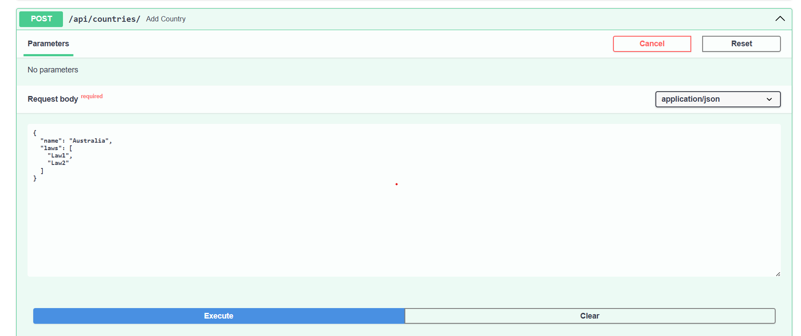

# Cyber-Laws
# Cyber Laws Across Countries

A web application that provides information about cybersecurity laws and regulations from different countries worldwide.

## Features

- 🌍 Browse cyber laws by country
- ➕ Add new countries and their laws
- 📱 Responsive design for all devices
- 🚀 FastAPI backend for data persistence

## Project Structure

```
├── bkend/
│   ├── main.py              # FastAPI application entry point
│   ├── requirements.txt     # Python dependencies
│   ├── routers/            
│   │   └── countries.py     # API route handlers
│   ├── models/
│   │   └── country.py       # Data models
│   └── services/
│       └── country_service.py # Business logic
├── js/
│   ├── data/
│   │   ├── countries.json    # Stored country data
│   │   └── dataService.js    # API client
│   ├── cyber-laws.js         # Country laws page logic
│   └── nav.js               # Navigation functionality
├── styles/
│   ├── main.css            # Global styles
│   ├── nav.css             # Navigation styles
│   ├── home.css            # Homepage styles
│   ├── about.css           # About page styles
│   └── cyber-laws.css      # Laws page styles
└── *.html                  # Page templates
```

## Setup

1. Install backend dependencies:
```bash
cd bkend
python -m venv env
.env\Scripts\activate
pip install -r requirements.txt
```

2. Start the backend server:
```bash
python -m uvicorn main:app --reload --port 8000
```

3. Open `index.html` in your browser or serve using a local server.

## API Endpoints

- `GET /api/countries` - Get all countries and their laws
- `POST /api/countries` - Add a new country with laws


## Add New Country

To add a new country and its cyber laws, follow these steps:

1. Navigate to the backend URL `http://localhost:8000/docs`.
2. Use the interactive API documentation to access the `POST /api/countries` endpoint.
3. Fill in the required details about the country and its cyber laws in the form provided.



## Contributing

1. Fork the repository
2. Create a feature branch
3. Commit your changes
4. Push to the branch
5. Create a Pull Request

## License

MIT License - feel free to use this project for any purpose.